 

## A little bit about me

I am currently a computer science student, but with my passion for programming, I started coding way before attending university. I'm primarily doing full stack web development, but I am interested in learning more about all kinds of programming . including but not limited to Desktop application development, game development, Data Science. Time to time I dabble with some low level programming too! like socket programming.

I enjoy using my obsessive need for perfection to create software that is both beautiful and functional. I am always looking for new ways to improve my code and learn new things.

**Talking about Personal Stuffs:**

- 👨🏻‍💻 I’m currently working on a university project where we build a cutomized LMS and a institute management system focusing on distributing content more securely and encouraging interaction between students and tutors for a private tution institute.

- 🚀 I’m currently experimenting with Godot Game engine;
- 💬 Ask me about anything, I am happy to help;
- 📫 Email me at nethsarasandeepaelvitigala@gmail.com;
- or connect with me on   
    
    
    
    
- 📝 [Check my CV](https://aqua-valentine-6.tiiny.site/)

 

<!--  -->

Here's a summary of my work so far!

