  
You are also one of them :wink:

## A little bit about me

I am currently a computer science student, but with my passion for programming, I started coding way before attending university. I'm primarily doing web development, but I am interested in learning more about all kinds of programming . including but not limited to Desktop development, game development, Data Science.

I enjoy using my obsessive need for perfection to create something that is both beautiful and functional. I am always looking for new ways to improve my code and learn new things.

**Talking about Personal Stuffs:**

- 👨🏻‍💻 I’m currently working on a university project that is essentially a AutoMobile service & product management system but with a twist along with my group members.

- 🚀 I’m currently experimenting with PHP;
- 💬 Ask me about anything, I am happy to help;
- 📫 Email me at nethsarasandeepaelvitigala@gmail.com;
- or connect with me on   
    
    
    
    <!--  -->
<!-- - 📝 [Resume](https://gkassym.netlify.app/Resume.pdf). -->

 

<!--
**Nethrenial/Nethrenial** is a ✨ _special_ ✨ repository because its `README.md` (this file) appears on your GitHub profile.

Here are some ideas to get you started:

- 🔭 I’m currently working on ...
- 🌱 I’m currently learning ...
- 👯 I’m looking to collaborate on ...
- 🤔 I’m looking for help with ...
- 💬 Ask me about ...
- 📫 How to reach me: ...
- 😄 Pronouns: ...
- ⚡ Fun fact: ...
-->
